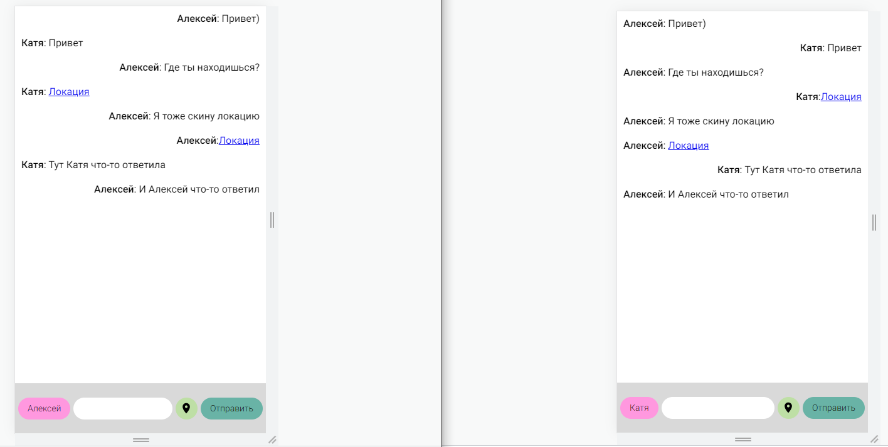

# Простой чат (socket.io)

Чат сделан на JS, HTML и CSS. С помощью socket.io происходит обмен данными в реальном времени, так же с помощью navigator.geolocation чат способен запрашивать геопозицию и отправляю ее. Чат был сделан с целью освоить и закрепить socket.io и navigator.geolocation.
## Screenshots



## Установка

Intsall & Run
```bash
  npm i
  node index.js
```


## 🚀 Контакты


Telegram: https://t.me/alekshelis

Email: alekshelis@yandex.ru